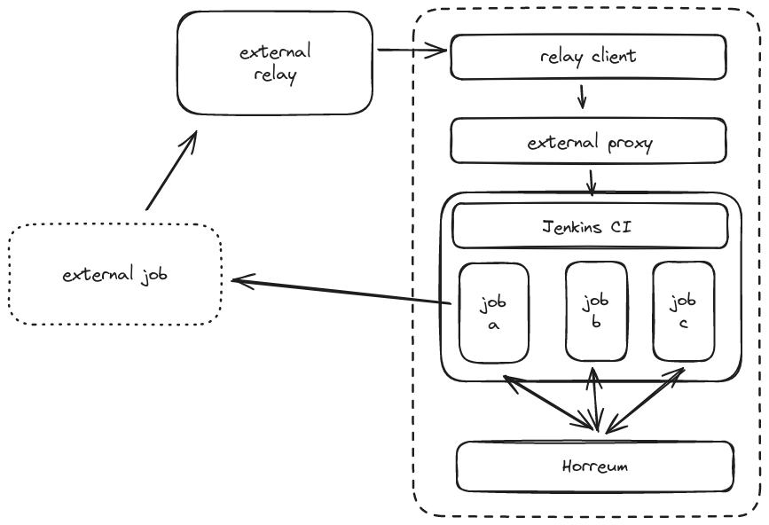

# Perf lab CI lab-proxy

The perf lab CI lab-proxy is a simple Quarkus application that acts as a
notification proxy for the external services used in the perf lab CI pipeline. 

The proxy works with a number of external services, including:
* smee.io
* webhookrelay.com

To provide a push notifications to CI pipelines.



## Usage

The proxy is published as a container image on quay.io `quay.io/app-svc-perf/lab-proxy:0.0.1-SNAPSHOT`


To start the proxy;

```shell
$ ./script/start-proxy.sh
```
